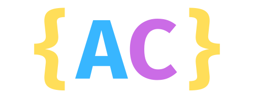

# 🌐 AlixarCoders — Comunidad de Desarrolladores Web del [I.E.S. ALIXAR](https://iesalixar.org)




Bienvenido al repositorio oficial de **AlixarCoders**, la comunidad de Desarrolladores Web del **I.E.S. ALIXAR**. 
Este proyecto reúne recursos, proyectos y buenas prácticas para aprender, construir y desplegar aplicaciones web de calidad.
¡Somos Unicornios! ¡SOMOS FULL STACK WEB DEVELOPERS!

---

## 🚀 Tecnologías que usamos

- **Frontend:** Angular, React, Bootstrap, Tailwind, SASS  
- **Backend:** Java (Spring Boot), PHP (Symfony), ExpressJS, Python (Django)  
- **Bases de datos:** MongoDB, MariaDB  
- **DevOps:** Docker, Kubernetes, Jenkins, Git  
- **UI/UX:** Figma  

---

## 📑 Contenidos de la web

### 🔝 Hero
- Presentación de la comunidad: *Comunidad de Desarrolladores Web del I.E.S. ALIXAR*  
- Enlaces destacados:
  - [Repositorios en GitHub](https://github.com/AlixarCoders)  
  - [Únete a nuestro LinkedIn](https://www.linkedin.com/company/tu-enlace)  

### 📚 Recursos
- **Padlet:** tablón visual con infografías y cheatsheets  
- **YouTube:** canal de charlas, tutoriales y contenido de la comunidad  

### 📜 Decálogo
Zona libre de *código espagueti* 🍝  
1. ⚙️ Compilamos calidad  
2. 🐞 Depuramos nuestro código  
3. 🔤 Escribimos código limpio y legible  
4. 🧅 Estructuramos el código en capas  
5. 📄 Documentamos el código con JavaDoc  
6. 🤖 Usamos la IA como ayuda, pero entendemos el código  
7. 🧪 Realizamos Tests Unitarios  
8. 🔐 Tenemos en cuenta la ciberseguridad desde el 0'  
9. 🌐 Somos Full Stack Developers (front + back)  
10. 🙌 Tu código habla por ti  

---

## 🖼️ Vista previa

La web principal está construida con **Bootstrap 5.3**, soporta **modo claro/oscuro automático** y utiliza **Fira Code** como tipografía principal.

---

## ⚙️ Cómo usar este repositorio

1. Clona el proyecto:
   ```bash
   git clone https://github.com/AlixarCoders/alixarcoders.github.io
   cd alixarcoders.github.io
   ```

2. Estructura básica:
   ```
   ├── index.html
   ├── assets/
   │   ├── css/styles.css
   │   ├── js/main.js
   │   ├── images/logo/logo.svg
   │   └── og-image.png
   ```

3. Abre `index.html` en tu navegador.  
   La web está preparada para GitHub Pages.

---

## 👥 Comunidad

- 📧 **Zona privada DAW2:** [Acceso restringido](https://sites.google.com/g.educaand.es/alixarcoders)  
- 🧾 **Padlet:** [Tablón visual](https://padlet.com/tu_padlet)  
- 🎥 **YouTube:** [Canal oficial](https://www.youtube.com/@alixarcoders)  
- 💼 **LinkedIn:** [Página de la comunidad](https://www.linkedin.com/company/alixarcoders)  

---

## 🛠️ Créditos

Desarrollado por el **Departamento de Informática del I.E.S. ALIXAR**.  
---
